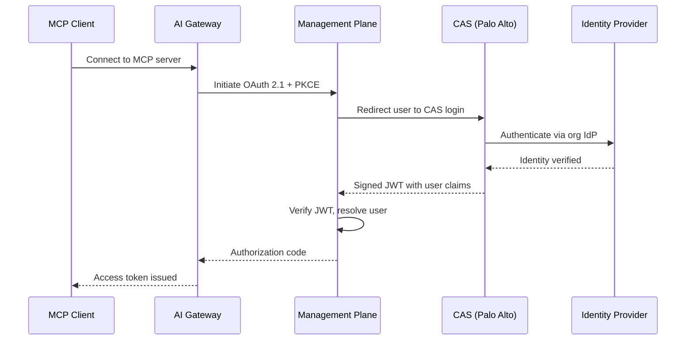

CAS (Cloud Authentication Service) is the OAuth 2.1 authentication method for MCP Gateway in **SCM (Strata Cloud Manager)** deployments. When an MCP client connects to a gateway running in SCM mode, CAS handles user authentication through Palo Alto Networks' identity infrastructure instead of Portkey's built-in OAuth.

<Info>
CAS authentication is only available for organizations running in **SCM deployment mode**. For standard Portkey deployments, use [Portkey OAuth](/product/mcp-gateway/authentication/oauth) or [External OAuth](/product/mcp-gateway/authentication/external-oauth) instead.
</Info>

---

## Overview

CAS bridges the MCP Gateway's OAuth 2.1 flow with Palo Alto Networks' centralized authentication. Instead of users logging in with Portkey credentials, they authenticate through their organization's identity provider (Entra ID, Okta, or on-prem Active Directory) via CAS.

### How It Works

1. **MCP client requests access** — The client (e.g., Cursor, Claude Desktop) connects to an MCP server through the AI Gateway without an API key.
2. **OAuth flow initiates** — The gateway starts an OAuth 2.1 flow with PKCE, redirecting through the Management Plane (Albus).
3. **CAS login** — The user is redirected to the CAS login page, where they authenticate using their organization's identity provider.
4. **JWT verification** — CAS returns a signed JWT containing the user's identity claims. The Management Plane verifies the JWT signature, validates claims, and resolves the user to a Portkey identity.
5. **Token issued** — An OAuth access token is issued to the MCP client, scoped to the user's workspace permissions.

---

## Prerequisites

Before CAS authentication works for your MCP Gateway:

1. **SCM deployment mode** — Your organization must be running in SCM mode with CAS activated by Palo Alto Networks.

2. **CIE Directory Sync configured** — Users must be provisioned into Portkey workspaces via [CIE Directory Sync](/product/enterprise-offering/org-management/directory-sync/cie-directory-sync). CAS authenticates users, but CIE is what provisions them into the system. Without CIE sync, authenticated users cannot be resolved to a Portkey identity.

3. **Authentication Profile selected** — An Auth Profile must be selected in the CIE Directory Sync configuration. This profile determines which identity provider is used for the CAS login flow. Auth Profiles are managed in the [CIE Authentication Profiles](https://docs.paloaltonetworks.com/identity/cloud-identity-engine/authenticate-users-with-the-cloud-identity-engine) console.

<Warning>
CAS relies on CIE for user provisioning. If CIE Directory Sync is not configured, or no group-workspace mappings exist, users will authenticate successfully with CAS but fail to resolve — resulting in an authorization error.

See [CIE Directory Sync](/product/enterprise-offering/org-management/directory-sync/cie-directory-sync) for setup instructions.
</Warning>

---

## Setup

CAS authentication is automatically enabled for organizations in SCM deployment mode. No additional configuration is required on the MCP Gateway side — the gateway detects SCM mode and routes authentication through CAS instead of Portkey's built-in OAuth.

### What the Admin Needs to Configure

| Step | Where | What |
|------|-------|------|
| 1. Connect a directory | CIE Console | Add your identity provider (Entra ID, Okta, AD) to CIE |
| 2. Configure Directory Sync | SCM AI Gateway → Admin Settings | Select the connected directory and user identity attribute |
| 3. Select Auth Profile | SCM AI Gateway → Admin Settings | Choose the CAS authentication profile for MCP auth |
| 4. Map groups to workspaces | SCM AI Gateway → Admin Settings | Map CIE groups to AI Gateway workspaces |

<Note>
**Email claim is required.** CAS identifies users by their email address. The identity provider must include the user's email in the authentication claims. If the email claim is missing from the CAS response, the user cannot be resolved and authentication will fail.

Ensure that the **User Identity Attribute** selected in CIE Directory Sync (UPN or Mail) matches the email attribute returned by your identity provider during CAS authentication.
</Note>

---

## User Experience

### First-Time Connection

When a user connects an MCP client to the gateway for the first time:

1. The MCP client opens a browser window.
2. The user sees the CAS login page (branded by their organization's identity provider).
3. After authenticating, a consent page appears showing which MCP server the client is requesting access to.
4. The user approves, and the browser redirects back to the MCP client.
5. The client now has an access token and can make MCP requests.

{/* Screenshot: CAS login page */}

{/* Screenshot: MCP consent page showing server name and requested permissions */}

### Subsequent Connections

After the initial authentication, the MCP client uses refresh tokens to maintain access. Users are not prompted to log in again until the refresh token expires or is revoked.

---

## How CAS Resolves Users

When CAS returns a signed JWT after authentication, the Management Plane performs the following resolution:

1. **JWT verification** — Validates the signature, issuer, audience, and expiration (`exp` claim is required).
2. **Email extraction** — Reads the user's email from the JWT claims.
3. **User lookup** — Matches the email to a user provisioned via CIE Directory Sync.
4. **Workspace resolution** — Determines which workspaces the user has access to based on CIE group-workspace mappings.
5. **Consent check** — If this is the user's first time accessing this MCP server, the consent page is shown.

If any step fails — invalid JWT, missing email, user not found, no workspace access — the flow returns an appropriate OAuth error to the client.

---

## Consent Flow

After authentication, users are shown a consent page before access is granted. The consent page displays:

- The **MCP server name** the client is requesting access to
- The **workspace** the access will be scoped to
- The **permissions** being requested

{/* Screenshot: Consent page with server details and approve/deny buttons */}

Users can approve or deny access. Approval is remembered — subsequent connections to the same server skip the consent page.

---

## Token Management

CAS-issued tokens follow the same lifecycle as standard Portkey OAuth tokens:

| Token | Lifetime | Purpose |
|-------|----------|---------|
| **Access token** | Short-lived | Used for MCP requests. Scoped to user + workspace. |
| **Refresh token** | Long-lived | Used to obtain new access tokens without re-authentication. |

Token refresh is handled transparently by the MCP client. When an access token expires, the client uses the refresh token to get a new one without user interaction.

---

## Upstream OAuth (Server-Side)

CAS handles **gateway authentication** (client → gateway). For **server authentication** (gateway → MCP server), the standard upstream OAuth flow applies separately. If an MCP server requires its own OAuth (e.g., a Linear or GitHub MCP server), the gateway handles that independently after the user is authenticated via CAS.

The two flows are:
1. **CAS** — Proves the user's identity to the gateway
2. **Upstream OAuth** — Gets the user's consent and tokens for the target MCP server

Both happen seamlessly in a single browser interaction when needed.

---

## Security

CAS authentication includes the following security measures:

| Measure | Description |
|---------|-------------|
| **OAuth 2.1 + PKCE** | Prevents authorization code interception attacks |
| **Signed JWTs** | CAS response tokens are cryptographically signed and verified |
| **One-time session markers** | Prevents session replay attacks |
| **Expiration validation** | JWT `exp` claim is required — tokens without expiration are rejected |
| **Scheme validation** | Redirect URLs are validated to block `javascript:`, `data:`, and other dangerous schemes |
| **CSP headers** | All authentication pages include Content Security Policy headers |
| **X-Frame-Options** | All authentication pages set `DENY` to prevent clickjacking |
| **Cache-Control** | All authentication responses set `no-store` to prevent caching |

---

## Comparison with Other Auth Methods

| Feature | CAS (SCM) | Portkey OAuth | External OAuth |
|---------|-----------|---------------|----------------|
| **Deployment** | SCM only | All deployments | All deployments |
| **Identity provider** | Palo Alto CAS → org IdP | Portkey accounts | Customer's IdP |
| **User provisioning** | Via CIE Directory Sync | Self-service signup | Manual or SCIM |
| **Consent flow** | Yes | Yes | Depends on IdP |
| **Token management** | Automatic | Automatic | Customer manages |
| **MCP client support** | All standard MCP clients | All standard MCP clients | All standard MCP clients |

---

## Troubleshooting

| Issue | Cause | Resolution |
|-------|-------|------------|
| User authenticates but gets "authorization failed" | User not provisioned via CIE | Configure [CIE Directory Sync](/product/enterprise-offering/org-management/directory-sync/cie-directory-sync) and verify group-workspace mappings |
| "Email not found in claims" error | IdP not returning email attribute | Ensure the IdP includes the email claim. Verify the User Identity Attribute (UPN vs Mail) in CIE matches what the IdP returns |
| CAS login page not appearing | Organization not in SCM mode | CAS is only available for SCM deployments. Use [Portkey OAuth](/product/mcp-gateway/authentication/oauth) for standard deployments |
| Consent page shows but redirect fails | Browser blocking the redirect | Check for browser extensions or corporate policies blocking redirects to custom URI schemes (`cursor://`, `vscode://`) |
| Token refresh fails | Refresh token expired or revoked | User must re-authenticate through the CAS flow |

---

## Related

| Topic | Description |
|-------|-------------|
| [CIE Directory Sync](/product/enterprise-offering/org-management/directory-sync/cie-directory-sync) | Provision users from CIE into AI Gateway workspaces (required for CAS) |
| [SCM Architecture](/self-hosting/hybrid-deployments/scm-architecture) | Architecture guide for SCM deployment mode |
| [OAuth](/product/mcp-gateway/authentication/oauth) | Portkey's built-in OAuth for non-SCM deployments |
| [External OAuth](/product/mcp-gateway/authentication/external-oauth) | Bring your own identity provider |

import PrismaAirsCta from "/snippets/prisma-airs-cta.mdx";

<PrismaAirsCta />
