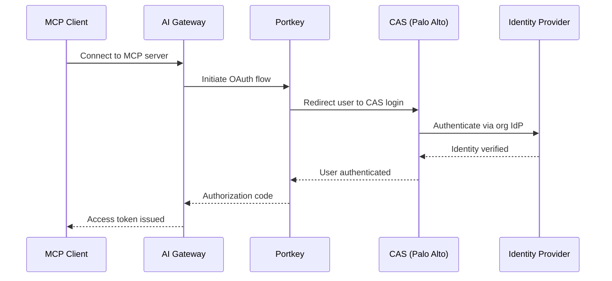

CAS (Cloud Authentication Service) is the OAuth 2.1 authentication method for MCP Gateway in **SCM (Strata Cloud Manager)** deployments. When an MCP client connects to a gateway running in SCM mode, CAS handles user authentication through Palo Alto Networks' identity infrastructure instead of Portkey's built-in OAuth.

<Info>
For standard Portkey deployments, use [Portkey OAuth](/product/mcp-gateway/authentication/oauth) or [External OAuth](/product/mcp-gateway/authentication/external-oauth) instead.
</Info>

---

## Overview

CAS bridges the MCP Gateway's OAuth flow with Palo Alto Networks' centralized authentication. Instead of users logging in with Portkey credentials, they authenticate through their organization's identity provider (Entra ID, Okta, or on-prem Active Directory) via CAS.

### How It Works

---

## Prerequisites

Before CAS authentication works for your MCP Gateway:

1. **CIE Directory Sync configured** — Users must be provisioned into workspaces via [CIE Directory Sync](/product/enterprise-offering/org-management/directory-sync/cie-directory-sync). CAS authenticates users, but CIE is what provisions them into the system. Without CIE sync, authenticated users cannot be resolved.

2. **Authentication Profile selected** — An Auth Profile must be selected in the CIE Directory Sync configuration. This profile determines which identity provider is used for the CAS login flow. Auth Profiles are managed in the [CIE Authentication Profiles](https://docs.paloaltonetworks.com/identity/cloud-identity-engine/authenticate-users-with-the-cloud-identity-engine) console.

<Warning>
CAS relies on CIE for user provisioning. If CIE Directory Sync is not configured, or no group-workspace mappings exist, users will authenticate successfully with CAS but fail to resolve — resulting in an authorization error.

See [CIE Directory Sync](/product/enterprise-offering/org-management/directory-sync/cie-directory-sync) for setup instructions.
</Warning>

---

## Setup

CAS authentication is automatically enabled. No additional configuration is required on the MCP Gateway side — the gateway routes authentication through CAS.

### What the Admin Needs to Configure

| Step | Where | What |
|------|-------|------|
| 1. Connect a directory | CIE Console | Add your identity provider (Entra ID, Okta, AD) to CIE |
| 2. Configure Directory Sync | AI Gateway → Admin Settings | Select the connected directory and user identity attribute |
| 3. Select Auth Profile | AI Gateway → Admin Settings | Choose the CAS authentication profile for MCP auth |
| 4. Map groups to workspaces | AI Gateway → Admin Settings | Map CIE groups to AI Gateway workspaces |

<Note>
**Email claim is required.** CAS identifies users by their email address. The identity provider must include the user's email in the authentication claims. If the email claim is missing, the user cannot be resolved and authentication will fail.

Ensure that the **User Identity Attribute** selected in CIE Directory Sync (UPN or Mail) matches the email attribute returned by your identity provider during CAS authentication.
</Note>

---

## User Experience

### First-Time Connection

When a user connects an MCP client to the gateway for the first time, the MCP client opens a browser window and the CAS login page is shown.

**Step 1 — Authenticate with your identity provider**

The user enters their organization credentials on the CAS Single Sign-on page. This page is hosted by Palo Alto Networks and connects to your configured identity provider (Entra ID, Okta, or on-prem AD).

**Step 2 — Approve access to the MCP server**

After authentication, the user is shown a consent page. It displays the MCP server being requested, the workspace it belongs to, and the redirect destination. The user can approve or reject the request.

Once approved, the browser redirects back to the MCP client with an access token. The client can now make MCP requests.

### Subsequent Connections

After the initial authentication, the MCP client uses refresh tokens to maintain access. Users are not prompted to log in again until the refresh token expires or is revoked. Approval is also remembered — subsequent connections to the same MCP server skip the consent page.

---

## Comparison with Other Auth Methods

| Feature | CAS (SCM) | Portkey OAuth | External OAuth |
|---------|-----------|---------------|----------------|
| **Identity provider** | Palo Alto CAS → org IdP | Portkey accounts | Customer's IdP |
| **User provisioning** | Via CIE Directory Sync | Self-service signup | Manual or SCIM |
| **Consent flow** | Yes | Yes | Depends on IdP |
| **Token management** | Automatic | Automatic | Customer manages |
| **MCP client support** | All standard MCP clients | All standard MCP clients | All standard MCP clients |

---

## Troubleshooting

| Issue | Cause | Resolution |
|-------|-------|------------|
| User authenticates but gets "authorization failed" | User not provisioned via CIE | Configure [CIE Directory Sync](/product/enterprise-offering/org-management/directory-sync/cie-directory-sync) and verify group-workspace mappings |
| "Email not found in claims" error | IdP not returning email attribute | Ensure the IdP includes the email claim. Verify the User Identity Attribute (UPN vs Mail) in CIE matches what the IdP returns |
| Consent page shows but redirect fails | Browser blocking the redirect | Check for browser extensions or corporate policies blocking redirects to custom URI schemes (`cursor://`, `vscode://`) |
| Token refresh fails | Refresh token expired or revoked | User must re-authenticate through the CAS flow |

---

## Related

| Topic | Description |
|-------|-------------|
| [CIE Directory Sync](/product/enterprise-offering/org-management/directory-sync/cie-directory-sync) | Provision users from CIE into AI Gateway workspaces (required for CAS) |
| [SCM Architecture](/self-hosting/hybrid-deployments/scm-architecture) | Architecture guide for SCM deployment mode |
| [OAuth](/product/mcp-gateway/authentication/oauth) | Portkey's built-in OAuth for non-SCM deployments |
| [External OAuth](/product/mcp-gateway/authentication/external-oauth) | Bring your own identity provider |

import PrismaAirsCta from "/snippets/prisma-airs-cta.mdx";

<PrismaAirsCta />
