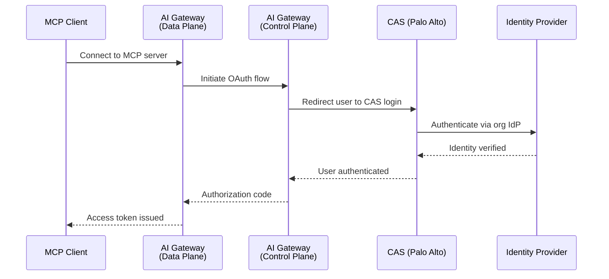

CAS (Cloud Authentication Service) is the OAuth 2.1 authentication method for MCP Gateway in **SCM (Strata Cloud Manager)** deployments. When an MCP client connects to a gateway running in SCM mode, CAS handles user authentication through Palo Alto Networks' identity infrastructure instead of the AI Gateway's built-in OAuth.

<Info>
For standard deployments, use [AI Gateway OAuth](/product/mcp-gateway/authentication/oauth) or [External OAuth](/product/mcp-gateway/authentication/external-oauth) instead.
</Info>

<Warning>
**Self-hosted MCP Gateway only.** OAuth in SCM currently works only with self-hosted (enterprise) MCP Gateway deployments. It is not available on the cloud-managed gateway.
</Warning>

---

## Overview

CAS bridges the MCP Gateway's OAuth flow with Palo Alto Networks' centralized authentication. Instead of users logging in with standard credentials, they authenticate through their organization's identity provider (Entra ID, Okta, or on-prem Active Directory) via CAS.

### How It Works



---

## Prerequisites

Before CAS authentication works for your MCP Gateway:

1. **CIE Directory Sync configured** — Users must be provisioned into workspaces via [CIE Directory Sync](/product/enterprise-offering/org-management/directory-sync/cie-directory-sync). CAS authenticates users, but CIE is what provisions them into the system. Without CIE sync, authenticated users cannot be resolved.

2. **Authentication Profile selected** — An Auth Profile must be selected in the CIE Directory Sync configuration. This profile determines which identity provider is used for the CAS login flow. Auth Profiles are managed in the [CIE Authentication Profiles](https://docs.paloaltonetworks.com/identity/cloud-identity-engine/authenticate-users-with-the-cloud-identity-engine) console.

<Warning>
CAS relies on CIE for user provisioning. If CIE Directory Sync is not configured, or no group-workspace mappings exist, users will authenticate successfully with CAS but fail to resolve — resulting in an authorization error.

See [CIE Directory Sync](/product/enterprise-offering/org-management/directory-sync/cie-directory-sync) for setup instructions.
</Warning>

---

## Setup

CAS authentication is automatically enabled. No additional configuration is required on the MCP Gateway side — the gateway routes authentication through CAS.

### What the Admin Needs to Configure

| Step | Where | What |
|------|-------|------|
| 1. Connect a directory | CIE Console | Add your identity provider (Entra ID, Okta, AD) to CIE |
| 2. Configure Directory Sync | AI Gateway → Admin Settings | Select the connected directory and user identity attribute |
| 3. Select Auth Profile | AI Gateway → Admin Settings | Choose the CAS authentication profile for MCP auth |
| 4. Map groups to workspaces | AI Gateway → Admin Settings | Map CIE groups to AI Gateway workspaces |

<Warning>
**Don't skip the Auth Profile step.** Selecting an Authentication Profile (Step 3) is required for the CAS login flow to work. Without it, users will not be redirected to the CAS login page and authentication will fail silently. This is the most commonly missed configuration step.
</Warning>

<Note>
**Email claim is required.** CAS identifies users by their email address. The identity provider must include the user's email in the authentication claims. If the email claim is missing, the user cannot be resolved and authentication will fail.

Ensure that the **User Identity Attribute** selected in CIE Directory Sync (UPN or Mail) matches the email attribute returned by your identity provider during CAS authentication.
</Note>

---

## End-to-end example: GitHub MCP server

This walkthrough connects the hosted **GitHub MCP server** as an upstream server behind MCP Gateway in SCM mode. It shows both authentication layers in action:

| Layer | What happens | Who authenticates |
|-------|--------------|-------------------|
| **Gateway auth** | User logs in via CAS and approves gateway access | User → CAS → org IdP |
| **Upstream auth** | Gateway exchanges an OAuth token with GitHub | Gateway → GitHub OAuth App |

<Note>
GitHub does not support Dynamic Client Registration (DCR), so you must create an OAuth App manually and supply the credentials to the gateway. Servers that support DCR (e.g., Linear, Notion) skip Steps 1–2 entirely.
</Note>

<Steps>

<Step title="Create a GitHub OAuth App">

Go to **GitHub** → **Settings** → **Developer settings** → **OAuth Apps** → **New OAuth App**.

| Field | Value |
|-------|-------|
| **Application name** | A name your users will recognize (e.g., `AIGW MCP`) |
| **Homepage URL** | Your SCM tenant URL (e.g., `https://stratacloudmanager.paloaltonetworks.com/`) |
| **Redirect URI** | `<YOUR_MCP_GATEWAY_URL>/oauth/upstream-callback` |
| **Expire user access tokens** | Enabled — issues a `refresh_token` so the gateway can refresh access silently |

Click **Register application**.


<Warning>
The redirect URI must match your gateway's public URL exactly, including scheme and port. A mismatch causes a `redirect_uri_mismatch` error from GitHub during the upstream authorization step.
</Warning>

</Step>

<Step title="Copy the client credentials">

On the OAuth App page:

1. Copy the **Client ID**
2. Click **Generate a new client secret** and copy the **Client Secret**

<Warning>
GitHub shows the client secret only once. Store it securely before leaving the page.
</Warning>

</Step>

<Step title="Add the MCP server in SCM">

In Strata Cloud Manager, go to **AI Security** → **AI Gateway** → **Integrations** → **MCP Registry** → **Add MCP Server**.

| Field | Value |
|-------|-------|
| **Name** | `Github Auth` (or any display name) |
| **URL** | `https://api.githubcopilot.com/mcp/` |
| **Server Type** | Streamable HTTP |
| **Authentication Type** | OAuth 2.1 |


In the **OAuth Metadata** field, paste the credentials from Step 2:

```json
{
  "client_id": "your_github_oauth_client_id",
  "client_secret": "your_github_oauth_client_secret",
  "token_endpoint_auth_method": "client_secret_post"
}
```

<Note>
`token_endpoint_auth_method` must be `client_secret_post`. GitHub does not accept HTTP Basic authentication (`client_secret_basic`) on its token endpoint, so omitting this field results in a token exchange failure.
</Note>

</Step>

<Step title="Provision workspaces and create the server">

Click **Next: Choose Workspace**, select the workspaces that should have access to this server, then create the MCP server.

<Tip>
If you provision the server to more than one workspace, users who belong to multiple workspaces will see a workspace selector on the consent page in Step 7.
</Tip>

</Step>

<Step title="Copy the MCP URL and connect your client">

Go to **AI Gateway** → **Catalogs**, open the server you just created, and copy its **MCP URL**.

Add the URL to your MCP client and click **Connect**:

```json
{
  "mcpServers": {
    "github": {
      "url": "<YOUR_MCP_SERVER_URL>"
    }
  }
}
```

No credentials go in the client config — the gateway handles both auth layers.

</Step>

<Step title="Sign in with CAS">

The client opens a browser and redirects you to the CAS **Single Sign-on** page. Enter your organization credentials and click **Login**.


<Note>
The login page appearance depends on your configured Authentication Profile. Organizations using an external IdP (Entra ID, Okta) see their own IdP login page instead.
</Note>

</Step>

<Step title="Approve gateway access">

The AI Gateway consent page opens, showing the MCP client requesting access and the redirect destination. If the server is provisioned to multiple workspaces, pick the workspace to scope the token to, then click **Approve**.


</Step>

<Step title="Authorize GitHub (upstream)">

Because this is the first time you are using the GitHub MCP server, you are redirected to GitHub's own authorization page. Review the requested scopes and organization access, then click **Authorize**.


<Note>
Organization-owned resources may show **Disallowed by org owner** with a **Request** button. A GitHub organization owner must approve the OAuth App before those repositories become available through the gateway.
</Note>

</Step>

<Step title="Connection established">

The browser redirects back to your MCP client and the connection succeeds. GitHub tools are now listed and callable through the gateway, with every call logged and governed by AI Gateway policies.

</Step>

</Steps>

### Troubleshooting this flow

| Issue | Cause | Resolution |
|-------|-------|------------|
| `redirect_uri_mismatch` from GitHub | Redirect URI in the OAuth App does not match the gateway URL | Set it to exactly `<YOUR_MCP_GATEWAY_URL>/oauth/upstream-callback` |
| Token exchange fails after GitHub authorize | Wrong client authentication method | Set `token_endpoint_auth_method` to `client_secret_post` in OAuth Metadata |
| GitHub consent page never appears | Upstream auth type not set to OAuth 2.1 | Edit the integration and set **Authentication Type** to OAuth 2.1 |
| Repositories missing after authorize | Org has not approved the OAuth App | Ask a GitHub org owner to approve the app under **Third-party access** |
| Re-prompted for GitHub authorization on every connect | `Expire user access tokens` disabled, so no refresh token is issued | Recreate/update the OAuth App with token expiry enabled |

---

## User Experience

### First-Time Connection

When a user connects an MCP client to the gateway for the first time, the client opens a browser and the user completes two consent steps:

1. **CAS login** — the user authenticates against your organization's identity provider.
2. **Gateway consent** — the user reviews the MCP server being requested, selects a workspace (if the server is provisioned to more than one), and approves.

If the upstream MCP server itself uses OAuth, a third step follows: the upstream service's own authorization page. See [End-to-end example: GitHub MCP server](#end-to-end-example-github-mcp-server) for the complete flow with screenshots.

### Subsequent Connections

After the initial authentication, the MCP client uses refresh tokens to maintain access. Users are not prompted to log in again until the refresh token expires or is revoked. Approval is also remembered — subsequent connections to the same MCP server skip the consent page.

---

## Comparison with Other Auth Methods

| Feature | CAS (SCM) | AI Gateway OAuth | External OAuth |
|---------|-----------|------------------|----------------|
| **Identity provider** | Palo Alto CAS → org IdP | AI Gateway accounts | Customer's IdP |
| **User provisioning** | Via CIE Directory Sync | Self-service signup | Manual or SCIM |
| **Consent flow** | Yes | Yes | Depends on IdP |
| **Token management** | Automatic | Automatic | Customer manages |
| **MCP client support** | All standard MCP clients | All standard MCP clients | All standard MCP clients |

---

## Troubleshooting

| Issue | Cause | Resolution |
|-------|-------|------------|
| User authenticates but gets "authorization failed" | User not provisioned via CIE | Configure [CIE Directory Sync](/product/enterprise-offering/org-management/directory-sync/cie-directory-sync) and verify group-workspace mappings |
| "Email not found in claims" error | IdP not returning email attribute | Ensure the IdP includes the email claim. Verify the User Identity Attribute (UPN vs Mail) in CIE matches what the IdP returns |
| Consent page shows but redirect fails | Browser blocking the redirect | Check for browser extensions or corporate policies blocking redirects to custom URI schemes (`cursor://`, `vscode://`) |
| Token refresh fails | Refresh token expired or revoked | User must re-authenticate through the CAS flow |

---

## Related

| Topic | Description |
|-------|-------------|
| [CIE Directory Sync](/product/enterprise-offering/org-management/directory-sync/cie-directory-sync) | Provision users from CIE into AI Gateway workspaces (required for CAS) |
| [SCM Architecture](/self-hosting/hybrid-deployments/scm-architecture) | Architecture guide for SCM deployment mode |
| [OAuth](/product/mcp-gateway/authentication/oauth) | AI Gateway's built-in OAuth for non-SCM deployments |
| [External OAuth](/product/mcp-gateway/authentication/external-oauth) | Bring your own identity provider |
| [GitHub MCP server](/integrations/mcp-servers/github-mcp-server) | Full tool reference for the GitHub MCP server |

import PrismaAirsCta from "/snippets/prisma-airs-cta.mdx";

<PrismaAirsCta />
