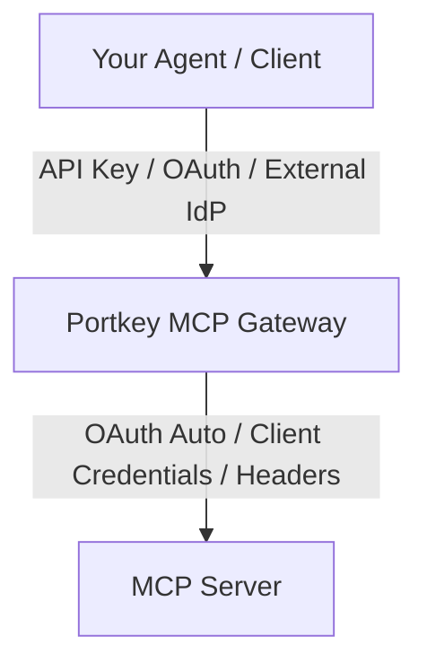

MCP Gateway handles authentication at two independent layers. Understanding this separation is key to configuring secure access.

## Two-Layer Architecture



| Layer | Who authenticates | Methods |
|-------|------------------|---------|
| **Gateway Auth** | Agent → Portkey | API Key, Portkey OAuth, External IdP |
| **Server Auth** | Portkey → MCP Server | OAuth Auto, Client Credentials, Headers |

These layers are independent. An agent authenticates to Portkey with an API key. Portkey authenticates to Linear with OAuth. The agent never sees Linear's OAuth tokens.

---

## Gateway Authentication

Agents prove their identity to Portkey before accessing MCP servers.

<Info>
**How it works:** Requests with an API key use API key auth. Requests with a JWT from an external IdP (with JWT validation configured) use JWT validation. Requests with neither trigger the OAuth flow. No configuration needed—just include an API key or don't.
</Info>

### API Key

The simplest method. Create an API key in Portkey and include it in requests.

```json
{
  "headers": {
    "x-portkey-api-key": "pk_xxx"
  }
}
```

API keys are scoped to workspaces. The key determines which MCP servers the request can access.

Create keys in **Settings > API Keys**. The key must have **`mcp invoke`** permissions.

### OAuth 2.1

For browser-based flows where users authenticate interactively. If no API key is provided, Portkey acts as the OAuth provider and initiates the consent flow. After authentication, your app receives a token to use for MCP requests.

This is useful for:
- End-user applications where users log in
- Interactive tools like Claude Desktop or Cursor (when not using API keys)
- User-level attribution without managing API keys

See [OAuth](/product/mcp-gateway/authentication/oauth) for details.

### External IdP (Bring Your Own Identity)

Use existing identity providers (Okta, Auth0, Azure AD, Cognito). Configure Portkey to validate tokens from your IdP. Users authenticate with existing identity systems—no Portkey accounts needed.

This is useful when:
- You have an existing IdP and want SSO
- Users who aren't in Portkey need MCP access
- Compliance requires your own identity infrastructure

See [External OAuth](/product/mcp-gateway/authentication/external-oauth) for setup.

---

## MCP Server Authentication

Portkey needs credentials to access upstream MCP servers. Configure this when adding a server.

### OAuth Auto

For MCP servers that support OAuth 2.1 with dynamic client registration. Portkey handles the full OAuth flow automatically.

When a user first calls a tool, Portkey initiates OAuth with the MCP server. The user completes consent (e.g., authorizing access to their Linear account). Portkey stores and refreshes tokens automatically.

Each user gets their own OAuth tokens. User A's Linear access is separate from User B's.

Customize the OAuth client metadata Portkey uses during registration. See [OAuth Client Metadata](/product/mcp-gateway/authentication/oauth-client-metadata).

### Client Credentials

For MCP servers using OAuth client credentials grant. You provide a client ID and secret when adding the server. Portkey fetches tokens and handles refresh.

All users share the same credentials to the MCP server. Use this for shared resources, not personal data.

### Custom Headers

For MCP servers using API keys or static tokens. Add headers when configuring the server.

```json
{
  "headers": {
    "x-portkey-api-key": "api_key_xxx",
    "X-API-Key": "your_key"
  }
}
```

Portkey includes these headers with every request. All users share the same credentials.

See [Custom Auth](/product/mcp-gateway/authentication/custom-auth) for details.

---

## Data Flow: Headers and Identity

Beyond authentication, Portkey supports passing contextual information to MCP servers:

### Identity Forwarding

After authenticating a user, Portkey can forward their identity claims to MCP servers. MCP servers can then make authorization decisions without implementing OAuth themselves.

Three methods:
- **Claims Header**: JSON object with user claims
- **Bearer Passthrough**: Forward the original token
- **Signed JWT**: Portkey-signed JWT with claims (cryptographically verifiable)

See [Identity Forwarding](/product/mcp-gateway/authentication/identity-forwarding).

### Header Forwarding

Forward headers from agent requests to MCP servers for distributed tracing, tenant context, or custom metadata.

```json
{
  "forward_headers": ["x-request-id", "x-trace-id", "x-tenant-id"]
}
```

See [Forwarding Headers](/product/mcp-gateway/authentication/forwarding-headers).

---

## Choosing the Right Method

| Scenario | Gateway Auth | MCP Server Auth |
|----------|--------------|-----------------|
| Internal developers using Portkey | API Key | OAuth Auto (per-user) |
| End customers with your IdP | External OAuth | OAuth Auto (per-user) |
| Service-to-service access | API Key | Client Credentials or Headers |
| Shared read-only resources | API Key | Custom Headers |

**Use per-user OAuth** when the MCP server accesses user-specific data (email, repos, messages). Each user authorizes their own access.

**Use shared credentials** when the MCP server provides shared resources (knowledge bases, analytics). All users see the same data.

---

## Credential Isolation

Credentials never cross boundaries.

```
Agent knows:      Portkey API key
Portkey knows:    MCP server OAuth tokens, API keys, user identity claims
MCP Server knows: Its own credentials
```

Agents can't see MCP server credentials. Compromised agent tokens don't expose upstream access. Rotate MCP server credentials without updating agents.

---

## Quick Reference

| Topic | Description |
|-------|-------------|
| [OAuth](/product/mcp-gateway/authentication/oauth) | Portkey's built-in OAuth 2.1 authentication |
| [External OAuth](/product/mcp-gateway/authentication/external-oauth) | Use your own identity provider |
| [JWT Validation](/product/mcp-gateway/authentication/jwt) | Validate JWTs from external IdPs |
| [Identity Forwarding](/product/mcp-gateway/authentication/identity-forwarding) | Pass user identity to MCP servers |
| [Forwarding Headers](/product/mcp-gateway/authentication/forwarding-headers) | Pass headers from agents to MCP servers |
| [OAuth Client Metadata](/product/mcp-gateway/authentication/oauth-client-metadata) | Customize OAuth registration |
| [Custom Auth](/product/mcp-gateway/authentication/custom-auth) | Configure custom headers for MCP servers |
