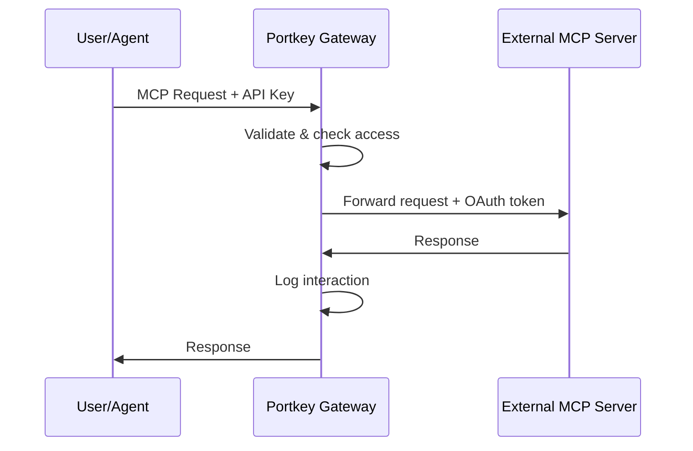

External MCP servers are third-party services that expose their APIs through the MCP protocol. Linear, GitHub, Slack, Notion—these services offer MCP endpoints that your agents can use.

**Add external servers to Portkey.** Get centralized access control, logging, and credential management without building infrastructure.

---

## Why Use Portkey for External MCP Servers

- **Centralized credential management.** OAuth tokens for Linear, GitHub, Slack—all managed in one place. Users authenticate once, Portkey handles token refresh.

- **Team-based access control.** Control which teams can access which external services. Revoke access instantly without rotating credentials.

- **Full observability.** See exactly which tools your agents are calling, who's using them, and what data is flowing through.

- **Unified authentication.** Your agents authenticate to Portkey with a single API key. Portkey handles the complexity of OAuth flows with each external service.

---

## Architecture



Two independent authentication layers:

| Layer | Purpose | Options |
|-------|---------|---------|
| **Gateway** | User proves identity to Portkey | API Key, OAuth, External IdP |
| **Server** | Portkey authenticates to external service | OAuth 2.1, Client Credentials, Headers |

Users authenticate to Portkey. Portkey authenticates to external services. Users never see external service credentials.

---

## Setup

### Add to MCP Registry

Go to **MCP Registry** → **Add MCP Integration**.

| Field | Value |
|-------|-------|
| **Name** | Display name (e.g., "Linear") |
| **Slug** | URL identifier (e.g., `linear`) |
| **Server URL** | The service's MCP endpoint |
| **Auth Type** | Usually OAuth 2.1 for external services |

### Configure OAuth

Most external MCP servers use OAuth. Adding a server with OAuth:

1. Portkey registers as an OAuth client with the service
2. Users complete OAuth consent when they first use the server
3. Portkey stores and refreshes tokens automatically

Each user gets their own OAuth tokens. User A's Linear access is separate from User B's.

#### Servers with Dynamic Client Registration (DCR)

Many MCP servers support OAuth 2.1 with Dynamic Client Registration. For these servers, just select **OAuth 2.1** as the auth type—Portkey handles client registration automatically.

#### Servers Requiring Manual OAuth App Setup

Some services (like **GitHub**) don't support DCR. For these:

1. Create an OAuth App in the service's developer settings
2. Set the callback URL to `https://mcp.portkey.ai/oauth/upstream-callback`
3. Add the `client_id`, `client_secret`, and `redirect_uri` in Portkey's **Advanced Configuration**

See the [GitHub MCP server guide](/integrations/mcp-servers/github-mcp-server#connect-via-portkey-mcp-gateway) for a detailed walkthrough.

### Provision Access

In **Access Control & Limits**, select which workspaces can access this server. Toggle per workspace or enable auto-provisioning for new workspaces.

### Connect

Users connect through Portkey:

```json
{
  "mcpServers": {
    "linear": {
      "url": "https://mcp.portkey.ai/linear/mcp",
      "headers": {
        "Authorization": "Bearer <PORTKEY_API_KEY>"
      }
    }
  }
}
```

The API key determines permissions. When a user first calls a tool, Portkey initiates OAuth with the external service if needed.

---

## OAuth Flows

### Per-User OAuth

When an MCP server uses per-user OAuth:

1. User calls a tool through Portkey
2. If no token exists, Portkey returns an authorization URL
3. User completes OAuth consent
4. Portkey stores the token
5. Subsequent requests use the stored token

This flow is common for services with user-specific data (Linear issues, GitHub repos, Slack messages).

### Shared Credentials

Some servers use shared credentials via client credentials grant or API keys:

- **Client Credentials**: Portkey fetches tokens using client ID/secret
- **Headers**: Static API keys sent with every request

Use shared credentials for services without user-specific data or for uniform access across users.

---

## Governance

**Observability** — Every request logged with tool name, parameters, response, user, team, timestamp, latency, and status.

**Access control** — Control which teams access which external services. The model is subtractive—each level can only remove access.

**Tool provisioning** — Enable or disable specific tools. Allow read operations while blocking writes.

---

## Next Steps

<CardGroup cols={2}>
  <Card title="Authentication" icon="lock" href="/product/mcp-gateway/authentication">
    Gateway auth and upstream server auth configuration.
  </Card>
  <Card title="Team Provisioning" icon="users" href="/product/mcp-gateway/access-control">
    Manage team and user permissions.
  </Card>
</CardGroup>
