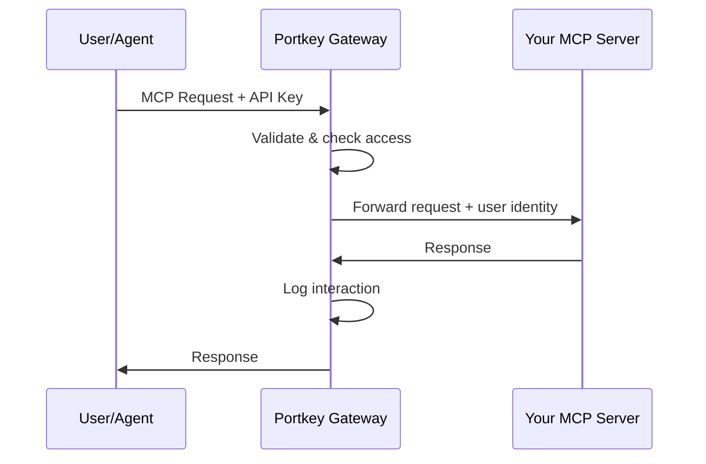

Your team has built MCP servers for internal docs, proprietary APIs, databases. Now you need authentication, access control, and logging for each one. Building that infrastructure is expensive. Maintaining it is harder.

**Add your internal servers to Portkey.** Get enterprise-grade infrastructure without writing a line of auth code.

---

## Why Use Portkey's MCP Gateway

- **Authentication without building auth.** Every MCP server needs it. Without Portkey, you build OAuth flows, validate tokens, manage sessions—for every server. With Portkey, authentication happens once at the gateway. Your servers receive authenticated requests.

- **User identity forwarding.** Your server often needs to know *who* is making a request. Portkey forwards user claims (email, team, roles) automatically. No OAuth implementation required.

- **Access control without deployments.** Control who accesses which servers and tools. When someone leaves a team, revoke access in Portkey. No code changes.

- **Full observability.** Every tool call logged—who called what, with what parameters, what was returned. Debug issues in minutes.

---

## Architecture



Two independent authentication layers:

| Layer | Purpose | Options |
|-------|---------|---------|
| **Gateway** | User proves identity to Portkey | API Key, OAuth, External IdP |
| **Server** | Portkey authenticates to your server | OAuth Auto, API Key None, Headers |

Users authenticate to Portkey with SSO. Portkey authenticates to your server with an API key. Users never see your server's credentials.

---

## Setup

Your MCP server must be accessible over HTTP and implement MCP protocol over Streamable HTTP transport.

<Note>
Using STDIO transport? Expose it as an HTTP endpoint first.
</Note>

### Add to MCP Registry

Go to **MCP Registry** → **Add MCP Integration**.

| Field | Value |
|-------|-------|
| **Name** | Display name (e.g., "Internal Documentation") |
| **Slug** | URL identifier (e.g., `internal-docs`) |
| **Server URL** | Your server's MCP endpoint |
| **Auth Type** | How Portkey authenticates to your server |

For **Auth Type**: use `None` if your server is in a private network, `Headers` for API keys, or `OAuth Auto` for servers supporting OAuth 2.1.

### Configure Identity Forwarding

If your server needs to know who's making requests, add identity forwarding config in **Advanced Configuration**.

<Tabs>
  <Tab title="JWT Header">
    Portkey generates a signed JWT with user claims. Your server verifies using Portkey's public keys.
    
    ```json
    {
      "user_identity_forwarding": {
        "method": "jwt_header",
        "include_claims": ["sub", "email", "workspace_id"],
        "header_name": "X-User-JWT"
      }
    }
    ```
    
    Verify the JWT using `GET https://mcp.portkey.ai/.well-known/jwks.json`
  </Tab>
  
  <Tab title="Claims Header">
    Portkey sends user claims as JSON. Simpler, no cryptographic verification.
    
    ```json
    {
      "user_identity_forwarding": {
        "method": "claims_header",
        "include_claims": ["sub", "email", "workspace_id"],
        "header_name": "X-User-Claims"
      }
    }
    ```
  </Tab>
  
  <Tab title="Bearer Passthrough">
    Forwards the original token unchanged. Use when your server validates tokens from the same IdP.
    
    ```json
    {
      "user_identity_forwarding": {
        "method": "bearer"
      }
    }
    ```
  </Tab>
</Tabs>

### Provision Access

In **Access Control & Limits**, select which workspaces can access this server. Toggle per workspace, enable auto-provisioning for new workspaces, or set tool-level permissions.

### Connect

Users connect through Portkey:

```json
{
  "mcpServers": {
    "internal-docs": {
      "url": "https://mcp.portkey.ai/internal-docs/mcp",
      "headers": {
        "Authorization": "Bearer <PORTKEY_API_KEY>"
      }
    }
  }
}
```

The API key determines permissions. Your server receives authenticated requests with user identity attached.

---

## Gateway Authentication

Three ways for users to authenticate to Portkey:

**API Key** — Create keys in **Settings → API Keys**. Keys are scoped to workspaces.

**Portkey OAuth** — For browser apps. If no API key provided, Portkey initiates an OAuth flow.

**External IdP** — Connect Okta, Azure AD, or Auth0. Users authenticate with corporate credentials.

```json
{
  "jwt_validation": {
    "jwksUri": "https://your-idp.com/.well-known/jwks.json",
    "algorithms": ["RS256"]
  }
}
```

---

## Governance

**Observability** — Every request logged with tool name, parameters, response, user, team, timestamp, latency, and status. View in **Logs** with filters.

**Access control** — Three levels: Organization (which servers exist), Workspace (which teams access which servers), User (individual permissions). The model is subtractive—each level can only remove access.

**Tool provisioning** — Enable or disable specific tools at any level. Block dangerous operations org-wide, restrict write tools for read-only teams, phase out deprecated tools. Disabled tools don't appear in listings.

**Rate limits** — Coming soon. Control request volume per user, team, or server.

---

## Example: Documentation Server

Your company built an MCP server for querying internal docs.

**Add to registry:** Name it "Internal Documentation", slug `internal-docs`, point to your server URL, configure headers auth with your internal API key.

**Configure identity:** Enable claims header forwarding with `sub`, `email`, `workspace_id`.

**Provision access:** Enable for Engineering and Product workspaces.

**Developers connect:**
```json
{
  "mcpServers": {
    "docs": {
      "url": "https://mcp.portkey.ai/internal-docs/mcp",
      "headers": { "Authorization": "Bearer pk_xxx" }
    }
  }
}
```

Developers use their Portkey API key. Your server receives user identity. Every query appears in Portkey logs. Access control managed centrally—no server changes needed.

---

## Next Steps

<CardGroup cols={2}>
  <Card title="Authentication" icon="lock" href="/product/mcp-gateway/authentication">
    Gateway auth and upstream server auth configuration.
  </Card>
  <Card title="Team Provisioning" icon="users" href="/product/mcp-gateway/access-control">
    Manage team and user permissions.
  </Card>
</CardGroup>
