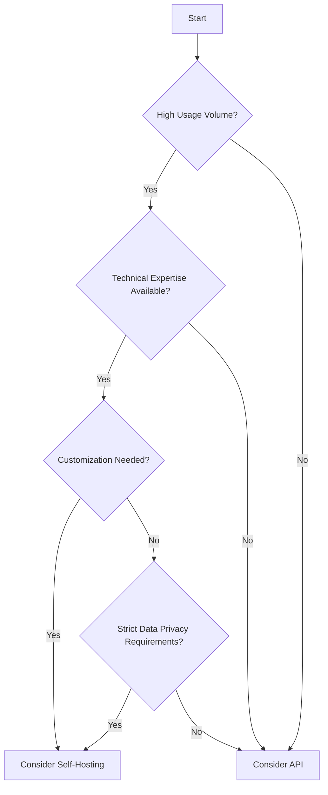

The decision between self-hosting LLMs and consuming them via APIs is crucial and depends on various factors. Each approach has its own set of advantages and challenges.

## Comparison

| Aspect | Self-Hosting | API Consumption |
|--------|--------------|-----------------|
| Control | Greater control over the model and infrastructure | Less control, dependent on provider |
| Cost | Potential for lower long-term costs for high-volume usage | Lower upfront costs, but potentially higher long-term costs |
| Privacy | Enhanced data privacy and security | Data leaves your environment |
| Expertise Required | Requires specialized expertise for deployment and maintenance | Minimal technical expertise required |
| Scalability | Less flexible in scaling | Easier scalability |
| Updates | Manual updates required | Regular updates handled by the provider |

## Decision Framework

Consider the following factors when deciding between self-hosting and API consumption:

1. **Usage Volume**: High-volume applications might benefit from self-hosting in the long run.
2. **Technical Expertise**: Consider your team's capability to manage self-hosted models.
3. **Customization Needs**: If extensive model customization is required, self-hosting might be preferable.
4. **Regulatory Requirements**: Some industries may require on-premises solutions for data privacy.
5. **Budget Structure**: Consider whether your organization prefers CapEx (self-hosting) or OpEx (API) models.

## Decision Tree

By carefully considering these factors and using this decision framework, organizations can make an informed choice between self-hosting LLMs and consuming them via APIs, optimizing for their specific needs and constraints.