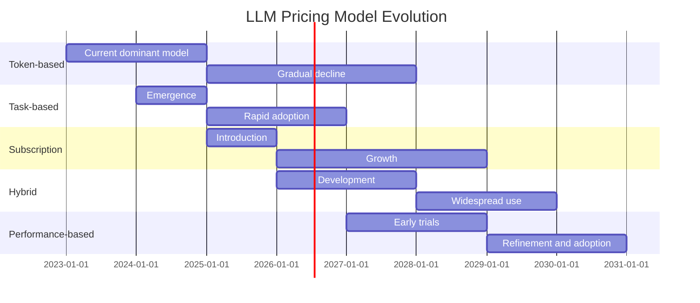

The pricing models for LLM usage are likely to evolve, offering new opportunities for cost optimization.

## Emerging Pricing Models

1. **Task-based Pricing**: Charging based on the complexity of the task rather than just token count.

2. **Subscription Models**: Offering unlimited access to certain models for a fixed monthly fee.

3. **Hybrid Pricing**: Combining usage-based and subscription models for flexibility.

4. **Performance-based Pricing**: Tying costs to the quality or accuracy of model outputs.

## Projected Evolution of LLM Pricing Models

As pricing models evolve, organizations will need to stay informed and adapt their strategies to leverage the most cost-effective options for their specific use cases.