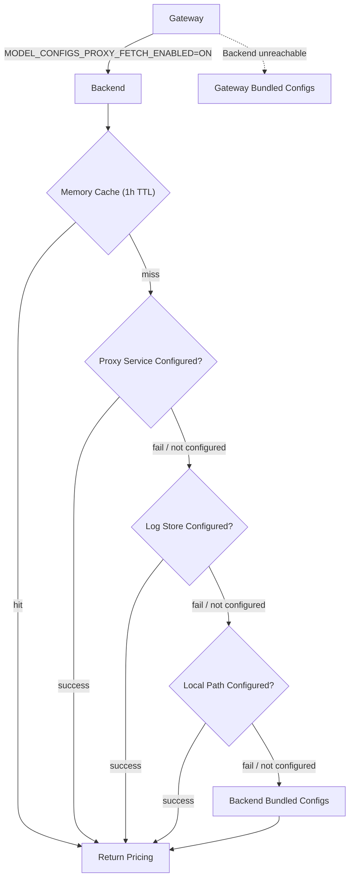

## Requirements
* [Helm chart](https://github.com/Portkey-AI/helm) `app-1.5.0+`
* [Backend](/changelog/backend#private-deployment-pricing) `v1.7.0+`
* [Enterprise Gateway](/changelog/enterprise#dynamic-model-pricing-for-air-gapped-deployments) `v2.0.0+`

## Overview

In air-gapped setups, the Gateway and Backend cannot access Portkey's hosted control plane for automatic pricing updates. Pricing and model capability data must be sourced locally or from an allowed endpoint.

**Flow:**

* The **Gateway** fetches pricing from the **Backend** when:

  ```
  MODEL_CONFIGS_PROXY_FETCH_ENABLED=ON
  ```
* The **Backend** resolves pricing using a fallback chain.

### Built-In Fallback Behavior

* If the Gateway cannot reach the Backend → it uses bundled pricing configs.
* If the Backend cannot reach any configured source → it uses bundled pricing configs.
* A baseline dataset is always available.


## Option 1: Use Portkey Hosted Config Service

Use when outbound HTTPS is allowed from Backend.

Backend fetches pricing and capabilities JSON from:

```
https://configs.portkey.ai/pricing/{provider}.json
https://configs.portkey.ai/general/{provider}.json
```

<Info>
No request data is sent to Portkey. Only static JSON files are retrieved. See the [Portkey Models API docs](/product/model-catalog/portkey-models) for the full schema.
</Info>

### Gateway

| Variable | Value |
| -------- | ----- |
| `MODEL_CONFIGS_PROXY_FETCH_ENABLED` | `ON` |

### Backend

| Variable | Value |
| -------- | ----- |
| `MODEL_CONFIGS_PROXY_FETCH_ENABLED` | `ON` |
| `MODEL_CONFIGS_PROXY_URL` | `https://configs.portkey.ai` |

Data is cached in memory for 1 hour.

## Option 2: Fully Air-Gapped (Self-Hosted Data)

Use when no outbound internet is allowed.

### Gateway

| Variable | Value |
| -------- | ----- |
| `MODEL_CONFIGS_PROXY_FETCH_ENABLED` | `ON` |

### Backend

Maintain a local copy of the open-source [Portkey Models repository](https://github.com/Portkey-AI/models).

Repository structure:

```
pricing/{provider}.json
general/{provider}.json
```

Example:

```
pricing/openai.json
general/openai.json
```

You can expose these files to Backend in two ways.

### 2A. Log Store

Upload pricing and capability JSON files to your object storage.

#### Backend Environment

| Variable | Description |
| -------- | ----------- |
| `MODEL_CONFIGS_PRICING_LOG_STORE_PATH` | Path to pricing JSON files |
| `MODEL_CONFIGS_CAPABILITIES_LOG_STORE_PATH` | Path to capabilities JSON files |

Expected structure:

```
{PRICING_PATH}/openai.json
{CAPABILITIES_PATH}/openai.json
```

**Updates**

* Replace JSON files in the same path.
* Backend refreshes within 1 hour (cache TTL).

### 2B. Local Volume Mount

Mount `pricing/` and `general/` directories to Backend.

#### Backend Environment

| Variable | Description |
| -------- | ----------- |
| `MODEL_CONFIGS_PRICING_LOCAL_PATH` | Mounted pricing directory |
| `MODEL_CONFIGS_CAPABILITIES_LOCAL_PATH` | Mounted capabilities directory |

Example Helm values:

```yaml
backend:
  extraVolumes:
    - name: model-configs
      configMap:
        name: portkey-model-configs
  extraVolumeMounts:
    - name: model-configs
      mountPath: /app/model-configs
  env:
    MODEL_CONFIGS_PRICING_LOCAL_PATH: /app/model-configs/pricing
    MODEL_CONFIGS_CAPABILITIES_LOCAL_PATH: /app/model-configs/general
```

**Updates**

* Update ConfigMap/PVC/mounted path.
* Restart Backend pods if required by your mount strategy.
* Data refreshes into memory cache.

---

## Keeping Pricing Updated

1. Pull latest files from the [models repository](https://github.com/Portkey-AI/models).
2. Update your log store or volume mount.
3. Backend refreshes within 1 hour.

For ConfigMap mounts, pod restart may be required.

## Related

- [Model Pricing and Cost Management](/product/observability/cost-management)
- [Portkey Models API](/product/model-catalog/portkey-models)
- [Backend Changelog](/changelog/backend)
- [Enterprise Gateway Changelog](/changelog/enterprise)
