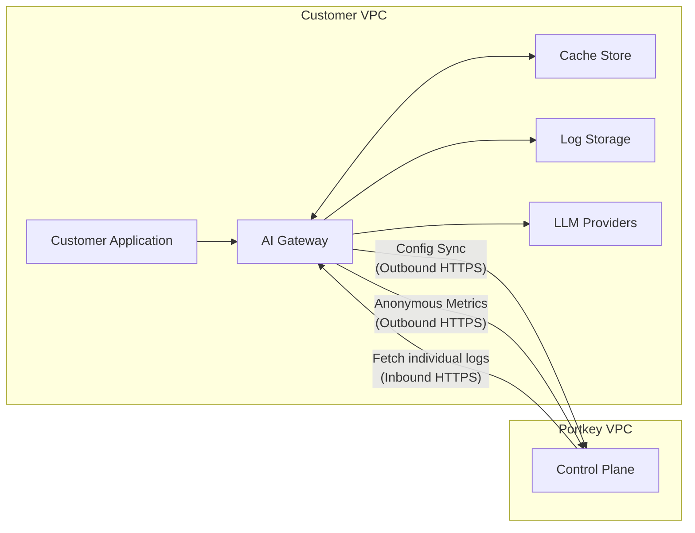

Portkey Enterprise offers a **secure hybrid deployment model** that balances security, flexibility, and fast deployment timelines:

- **Data Plane** runs within your VPC, keeping sensitive LLM data and AI traffic in your environment
- **Control Plane** hosted by Portkey handles administration, configs, and analytics

<Frame caption="Portkey Enterprise Hybrid Deployment Architecture">
  
</Frame>

<Card title="Schedule an Enterprise Architecture Demo" icon="calendar" href="https://portkey.wiki/demo-27">
  Want to learn more about our hybrid deployment model? Schedule a personalized demo with our solutions team to see how Portkey Enterprise can fit your security and compliance requirements.
</Card>

## Core Architecture Components

### Data Plane (Your VPC)

The Data Plane is deployed in your cloud environment and processes all your AI traffic:

| Component | Description | Security Benefit |
| :--------- | :----------- | :--------------- |
| **AI Gateway** | Core engine that routes traffic across LLM providers and implements metering, access control, and guardrails | All LLM requests remain in your network perimeter |
| **Cache Store** | Local cache storage for gateway consumption | Eliminates runtime dependency on Control Plane |
| **Data Store** | Storage for LLM request/response logs | Keep sensitive LLM data completely in your environment |

The AI Gateway runs as containerized workloads in your infrastructure, deployable via your preferred orchestration method (Kubernetes, ECS, etc.).

### Control Plane (Portkey VPC)

The Control Plane is fully managed by Portkey and provides the administrative layer for your deployment:

- Hosts the web dashboard for managing configurations, tracking analytics, and viewing logs
- Maintains routing configs, provider integrations
- Stores non-sensitive metadata and aggregated metrics
- Automatically updates with new features and provider integrations without requiring changes to your infrastructure

## Data Flow Between Planes

<Accordion icon="network-wired" title="AI Traffic Flow (Fully Contained in Your VPC)">
  All LLM traffic stays within your network boundary:
  
  1. Your application sends requests to the AI Gateway
  2. The Gateway processes the request (applying routing, caching, guardrails)
  3. The Gateway forwards the request to the appropriate LLM provider
  4. Responses from LLMs return through the same path
  
  **Security Benefit**: Complete isolation of sensitive prompt data and responses
</Accordion>

<Accordion icon="database" title="Data Sync (Gateway ↔ Control Plane)">
  The AI Gateway periodically synchronizes with the Control Plane:
  
  - **Frequency**: 30-second heartbeat intervals
  - **Data Retrieved**: Prompt templates, routing configs, integrations, providers, API keys
  - **Process**: Data is fetched, decrypted locally, and stored in the Gateway cache
  - **Resilience**: Gateway operates independently between syncs using cached configs
  
  **Security Benefit**: Continuous operation even during Control Plane disconnection
</Accordion>

<Accordion icon="chart-line" title="Analytics Flow (Gateway → Control Plane)">
  The Gateway sends anonymized metrics to the Analytics Store:
  
  - **Data Sent**: Non-sensitive operational metrics (model used, token counts, response times)
  - **Purpose**: Powers analytics dashboards for monitoring performance and costs
  - **Example**: [View sample analytics data](#sample-files)
  
  **Security Benefit**: Provides insights without exposing sensitive information
</Accordion>

<Accordion icon="files" title="Log Management Options">
  **Option A: Logs in Your VPC** (Recommended for high-security environments)
  - Logs stored in your environment's Blob Store
  - When viewing logs in Dashboard UI, Control Plane requests them from Gateway
  
  **Option B: Logs in Portkey Cloud**
  - Gateway encrypts and sends logs to Portkey Log Store
  - No connections required from Portkey to your environment for viewing logs
  
  **Security Benefit**: Flexibility to match your compliance requirements
</Accordion>

## Deployment Architecture

Portkey AI Gateway is deployed as containerized workloads using Helm charts for Kubernetes environments, with flexible deployment options for various cloud providers.

### Infrastructure Components

| Component | Description | Configuration Options |
|:----------|:------------|:----------------------|
| **AI Gateway** | Core container running the routing logic | Deployed as stateless containers that can scale horizontally |
| **Cache System** | Stores routing configs, integrations, providers, and more | Redis (in-cluster, AWS ElastiCache, or custom endpoint) |
| **Log Storage** | Persistence for request/response data | Multiple options (see below) |

### Storage Options

<Tabs>
  <Tab title="Object Storage">
    S3-compatible storage options including:
    - AWS S3 (standard credentials or assumed roles)
    - Google Cloud Storage (S3 compatible interoperability mode)
    - Azure Blob Storage (key, managed identity, or Entra ID)
    - Any S3-compatible Blob Storage
  </Tab>
  <Tab title="Document DB">
    MongoDB/DocumentDB for structured log storage with options for:
    - Direct connection string with username/password
    - Certificate-based authentication (PEM)
    - Connection pooling configurations
  </Tab>

</Tabs>

### Authentication Methods

<Tabs>
  <Tab title="Cloud Provider IAM">
    - IAM roles for service accounts (IRSA) in Kubernetes
    - Instance Metadata Service (IMDS) for EC2/ECS
    - Managed identities in Azure environments
  </Tab>
  <Tab title="Direct Authentication">
    - Standard access/secret keys
    - Certificate-based authentication
    - JWT-based authentication
  </Tab>
</Tabs>

### Infrastructure Requirements

- **Kubernetes Cluster**: K8s 1.20+ with Helm 3.x
- **Outbound Network**: HTTPS access to Control Plane endpoints
- **Container Registry Access**: For pulling gateway container images
- **Recommended Resource Requirements**: 
  - CPU: 1-2 cores per gateway instance
  - Memory: 2-4GB per gateway instance
  - Storage: Dependent on logging configuration

## Data Security & Encryption

<Tabs>
  <Tab title="Data Residency">
    **Your Sensitive Data Stays in Your VPC**
    - All prompt content and LLM responses remain within your network
    - Only anonymized metrics data cross network boundaries
    - Log storage location is configurable based on your requirements
  </Tab>
  <Tab title="Encryption Methods">
    **Multi-layered Encryption Approach**
    - All data in the Control Plane is encrypted at rest
    - Communication between planes uses TLS 1.3 encryption in transit
    - Sensitive data uses envelope encryption
    - Optional BYOK (Bring Your Own Key) support with AWS KMS integration
  </Tab>
  <Tab title="Access Controls">
    **Defense-in-Depth Security Model**
    - Network-level controls limit Control Plane access to authorized IPs
    - Role-based access control for administrative functions
    - Audit logging of all administrative actions
    - Access tokens are short-lived with automatic rotation
  </Tab>
</Tabs>

## Advantages of Hybrid Architecture

| Benefit | Technical Implementation | Business Value |
|:--------|:------------------------|:---------------|
| **Security & Compliance** | - Sensitive data never leaves VPC - Configurable encryption methods - Flexible authentication options | - Meets data residency requirements - Supports regulated industries - Simplifies security reviews |
| **Operational Efficiency** | - No database management overhead - Automatic model config updates - Horizontally scalable architecture | - Low operational burden - Always up-to-date with LLM ecosystem - Scales with your traffic patterns |
| **Deployment Flexibility** | - Kubernetes-native deployment - Support for major cloud providers - Multiple storage backend options | - Fits into existing infrastructure - Avoids vendor lock-in - Customizable to specific needs |
| **Developer Experience** | - OpenAI-compatible API - Simple integration patterns - Comprehensive observability | - Minimal code changes needed - Smooth developer onboarding - Full visibility into system behavior |

## Technical Rationale

<Accordion title="Why Maintain Transaction DB in Control Plane?">
  1. **Real-time Model Updates**: LLM providers frequently change model parameters, pricing, and availability. Centralizing this data ensures all gateways operate with current information.
  
  2. **Feature Velocity**: AI landscape evolves rapidly. Control Plane architecture allows Portkey to deliver new features multiple times per week without requiring customer-side deployments.
  
  3. **Operational Efficiency**: Eliminates need for customers to maintain complex database infrastructure solely for non-sensitive object management.
</Accordion>

<Accordion title="Why Cache Objects Locally?">
  1. **Performance**: Eliminates network latency during LLM requests by having all routing and configs data available locally.
  
  2. **Resilience**: Gateway continues operating even if temporarily disconnected from Control Plane.
  
  3. **Security**: Reduces attack surface by minimizing runtime external dependencies.
</Accordion>

## Sample Files

These samples demonstrate the typical data patterns flowing between systems:

<CardGroup>
  <Card title="Sample Log File (4KB)" href="https://github.com/Portkey-AI/docs-core/tree/main/images/enterprise/private-cloud-deployments/architecture/sample_log_file.json" icon="file-code"/>
  <Card title="Sample Metric File (3KB)" href="https://github.com/Portkey-AI/docs-core/tree/main/images/enterprise/private-cloud-deployments/architecture/sample_metric_file.json" icon="chart-line"/>
</CardGroup>

## Resources & Next Steps

<CardGroup cols={2}>
  <Card title="Helm Repository" href="https://github.com/Portkey-AI/helm" icon="github"/>
  <Card title="Enterprise Changelog" href="/changelog/enterprise" icon="clock-rotate-left"/>
  <Card title="AWS Deployment Guide" href="/product/enterprise-offering/private-cloud-deployments/aws" icon="aws"/>
  <Card title="Azure Deployment Guide" href="/product/enterprise-offering/private-cloud-deployments/azure" icon="microsoft"/>
</CardGroup>

## Have Questions?

Our solution architects are available to discuss your specific deployment requirements and security needs.

<Card title="Schedule Architecture Discussion" icon="calendar-check" href="https://portkey.wiki/demo-27">
  Book a personalized consultation with our enterprise team to explore how Portkey's architecture can be tailored to your organization's specific requirements.
</Card>
