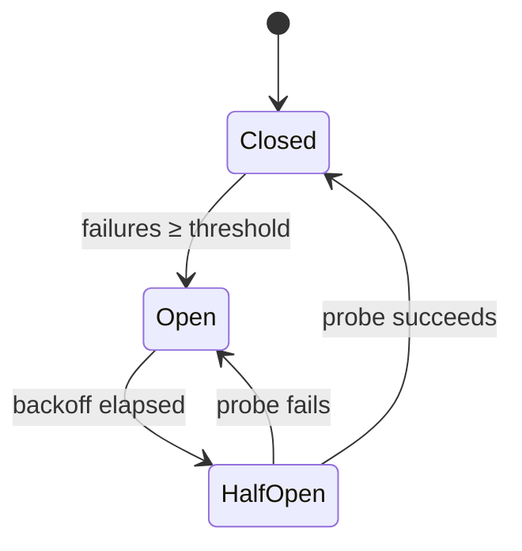

When the log store (S3-compatible object storage) becomes unreachable, the gateway would otherwise retry every write on every request — exhausting resources and amplifying the impact of an outage. The log store circuit breaker prevents this by tracking failures per storage endpoint and temporarily blocking log writes once consecutive failures exceed a configurable threshold.

<Info>
The log store circuit breaker is available in **Enterprise Gateway v2.11.2+**. It operates independently of the [request-routing circuit breaker](/product/ai-gateway/circuit-breaker) — it protects log writes, not LLM routing.
</Info>

## How It Works

The circuit breaker uses a **closed → open → half-open** state machine, keyed per log store endpoint:



| State | Behavior |
|-------|----------|
| **Closed** | All log writes pass through normally |
| **Open** | Log writes are fast-failed immediately; the endpoint is not contacted until the backoff elapses |
| **Half-Open** | One probe write is attempted; if it succeeds the circuit closes, if it fails the circuit re-opens |

### Failure Counting

Only retriable failures count toward the threshold:
- Network errors and connection timeouts
- HTTP 5xx responses from the storage backend
- HTTP 429 (rate-limited) responses

4xx responses other than 429 are treated as a health signal (the backend is reachable), so they reset the failure count without opening the circuit.

Per-call timeouts always count as failures regardless of HTTP status.

### Idle Eviction

Circuit entries for idle endpoints are automatically removed after `backoffMs × 2` (default: 120 seconds) of inactivity, keeping memory usage bounded.

## Configuration

The circuit breaker is tuned via environment variables on the gateway container. All three are optional — the defaults work for most deployments.

| Environment Variable | Default | Description |
|---------------------|---------|-------------|
| `LOG_STORE_CONNECTION_FAILURE_THRESHOLD` | `5` | Number of consecutive retriable failures before the circuit opens |
| `LOG_STORE_CONNECTION_BACKOFF_MS` | `60000` (60 s) | How long (ms) the circuit stays open before allowing a probe |
| `LOG_STORE_CONNECTION_TIMEOUT_MS` | `15000` (15 s) | Per-call timeout for each log write; exceeding this counts as a failure |

### Example (Kubernetes / Helm)

```yaml
env:
  - name: LOG_STORE_CONNECTION_FAILURE_THRESHOLD
    value: "3"
  - name: LOG_STORE_CONNECTION_BACKOFF_MS
    value: "30000"
  - name: LOG_STORE_CONNECTION_TIMEOUT_MS
    value: "10000"
```

<Tip>
For high-throughput gateways writing to S3-compatible storage, a lower `LOG_STORE_CONNECTION_FAILURE_THRESHOLD` (e.g., `3`) and shorter `LOG_STORE_CONNECTION_BACKOFF_MS` (e.g., `30000`) give faster detection and faster recovery.
</Tip>

## Observability

When the circuit opens, the gateway emits a log entry with the circuit key (derived from the storage endpoint hostname) and the current state. You can monitor these entries in your log aggregation stack to alert on log store availability.

Fast-failed writes are dropped silently from the user's perspective — LLM requests continue to be processed and return responses normally. This ensures a log store outage never degrades AI gateway throughput.

## Related

<CardGroup cols={2}>
  <Card title="Request-Routing Circuit Breaker" icon="rotate" href="/product/ai-gateway/circuit-breaker">
    Circuit breaker for LLM provider routing — separate from the log store circuit breaker.
  </Card>
  <Card title="Hybrid Deployment Architecture" icon="building" href="/self-hosting/hybrid-deployments/architecture">
    Log storage options and overall data plane architecture.
  </Card>
</CardGroup>
